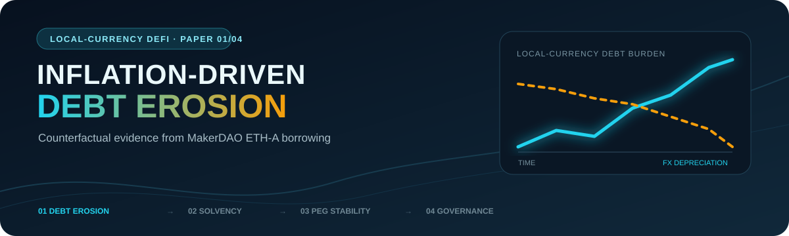
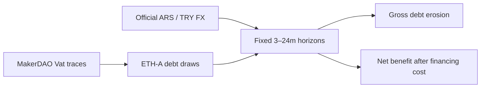

<p align="center">
  
</p>

<h1 align="center">Inflation-Driven Debt Erosion in Local-Currency DeFi Lending</h1>

<p align="center">
  <strong>Counterfactual Evidence from MakerDAO ETH-A Borrowing Activity</strong><br>
  Niko Rokni Lamouki · Salma Soofiyan · Amin Karami
</p>

<p align="center">
  
  
  
  
</p>

<p align="center">
  <a href="manuscript/main.pdf"><strong>Read the paper</strong></a> ·
  <a href="#reproduce"><strong>Reproduce the analysis</strong></a> ·
  <a href="#research-series"><strong>Explore the series</strong></a>
</p>

---

## At a glance

| Research question | Empirical base | Main contribution |
|---|---|---|
| How would high local-currency inflation change the real burden of DeFi debt? | 130,742 decoded MakerDAO ETH-A debt-draw events plus official ARS/USD and TRY/USD exchange rates | A transparent event-level counterfactual that measures gross and financing-cost-adjusted debt erosion over fixed horizons |

> [!IMPORTANT]
> This is a **counterfactual accounting exercise**. The observed events are DAI debt draws; the analysis asks what the same nominal amounts would look like if denominated in ARS or TRY. It does not estimate realised borrower profit, validate a deployed local-currency protocol, or treat urn identifiers as individual people.

## Research design



- **Event definition:** successful ETH-A `Vat.frob` calls with positive `dart`.
- **Debt amount:** normalized debt multiplied by the accumulated rate.
- **Observation window:** 1 January 2020 through 31 July 2023.
- **Minimum event size:** 1 DAI.
- **Evaluation horizons:** 3, 6, 12, and 24 months.
- **Scenarios:** gross FX erosion plus cost, duration, and collateral assumptions.

## Key findings

| Validation anchor | Result |
|---|---:|
| Successful raw `Vat` traces | 4,466,880 |
| Final ETH-A debt-draw events | 130,742 |
| Unique urn identifiers | 16,846 |
| Total debt drawn | 13,318,097,854.94 DAI |
| 12-month median gross benefit — ARS | 24.61% |
| 12-month median gross benefit — TRY | 25.30% |
| 12-month median net benefit at 20% annual cost — ARS | 2.78% |
| 12-month median net benefit at 20% annual cost — TRY | 6.71% |

The results establish the borrower-side accounting mechanism. The next papers ask whether the protocol, its secondary market, and its governance system can survive the same environment.

## Repository map

| Path | Contents |
|---|---|
| [`analysis/`](analysis/) | Event decoding, transformations, scenarios, and output generation |
| [`data/raw_fx/`](data/raw_fx/) | Official exchange-rate inputs |
| [`data/processed/`](data/processed/) | Analysis-ready event and FX files |
| [`results/`](results/) | Reproducible numerical outputs |
| [`figures/`](figures/) · [`tables/`](tables/) | Paper-ready exhibits |
| [`manuscript/`](manuscript/) | LaTeX source and compiled paper |
| [`documentation/`](documentation/) | Supporting technical notes |

## Reproduce

The analysis targets **Python 3.11**. To rebuild from the raw archive:

```bash
bash run_all.sh /path/to/Data_July_2023.zip
```

To rerun the core analysis from the included processed data:

```bash
python analysis/reproduce_analysis.py \
  --events data/processed/eth_a_debt_increases.csv \
  --fx-dir data/processed/fx \
  --outdir results
```

The generated counts, totals, tables, and horizon results should match the validation anchors above.

## Research series

| Paper | Focus | Repository |
|---:|---|---|
| **01** | **Inflation-driven debt erosion** | **You are here** |
| 02 | Joint FX and collateral shocks → protocol solvency | [local-currency-defi-solvency-stress-test](https://github.com/nikorokni/local-currency-defi-solvency-stress-test) |
| 03 | Liquidity and arbitrage constraints → peg stability | [local-currency-defi-peg-stability](https://github.com/nikorokni/local-currency-defi-peg-stability) |
| 04 | Oracle latency and automated controls → adaptive governance | [local-currency-defi-adaptive-governance](https://github.com/nikorokni/local-currency-defi-adaptive-governance) |

## Citation

If this package supports your work, please cite the paper:

> Rokni Lamouki, N., Soofiyan, S., & Karami, A. (2026). *Inflation-Driven Debt Erosion in Local-Currency DeFi Lending: Counterfactual Evidence from MakerDAO ETH-A Borrowing Activity.*

